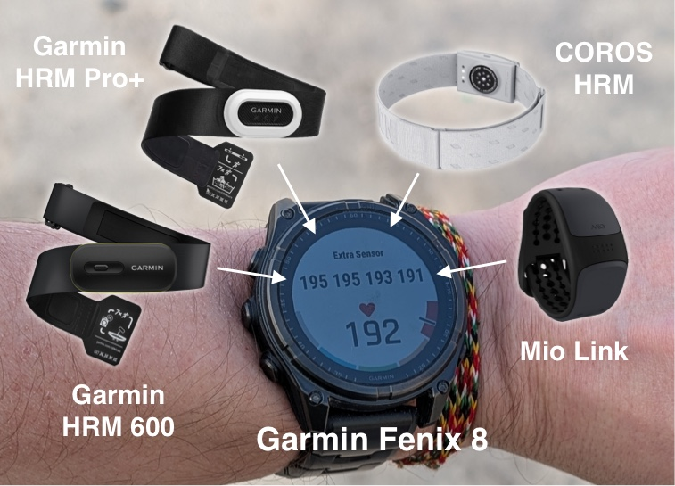
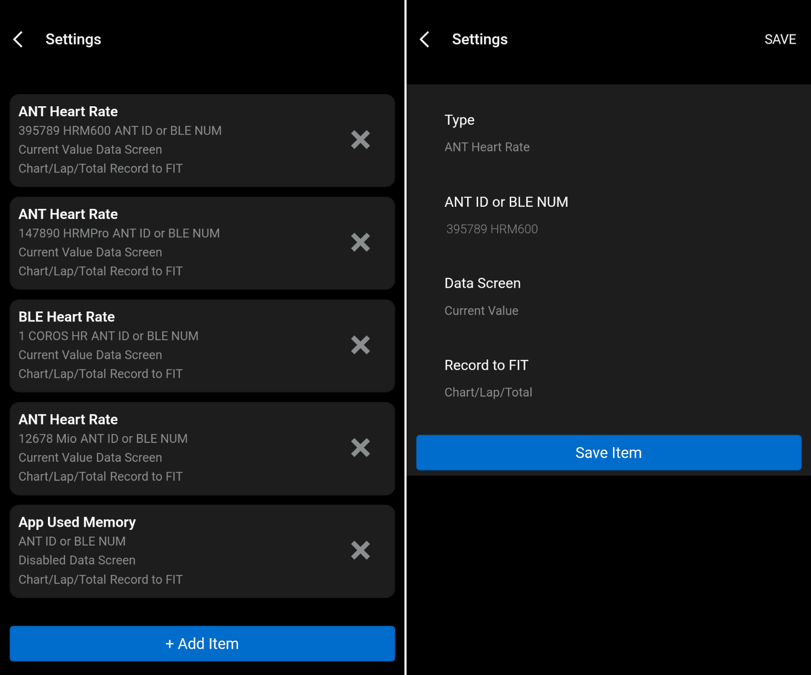
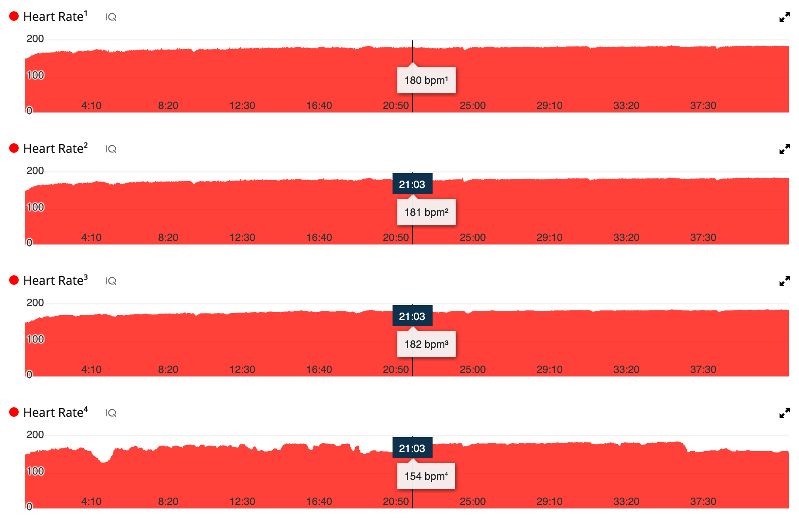
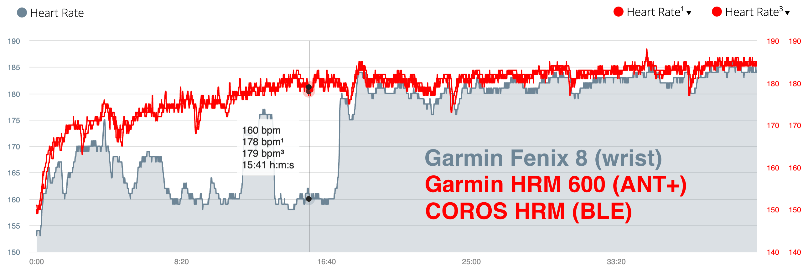
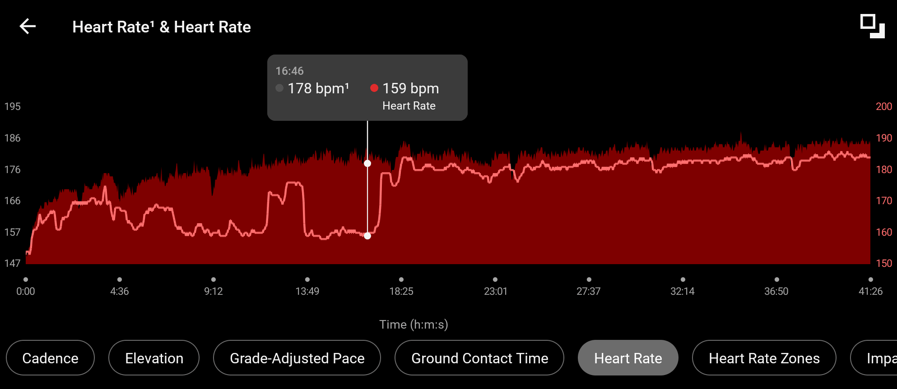
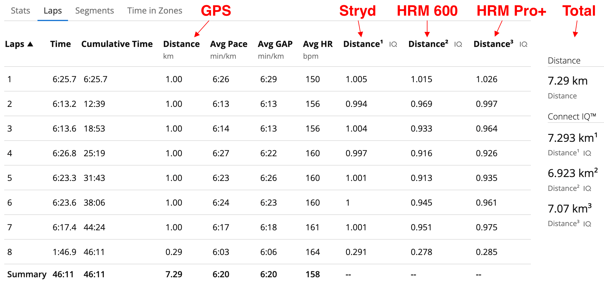

# Extra Sensor for Garmin

This Garmin Connect IQ DataField lets you add additional sensors to your workouts.

By default, Garmin watches record only one sensor of each type, for example, heart rate or distance. And that's enough for many users. But if you want to compare the readings from several sensors, this DataField is exactly what you need.

The number of external sensors you can connect is limited only by the capabilities of your Garmin devices. On modern models, this is up to 9 ANT sensors and 3 BLE sensors.

Currently supported:

- ANT+ and BLE Heart Rate Monitor
- ANT+ and BLE Running Speed and Distance

Tested devices:

- Garmin fēnix® 3 (ANT+)
- Garmin fēnix® 6S (ANT+ and BLE)
- Garmin fēnix® 8 (ANT+ and BLE)
- Garmin HRM-Pro Plus (ANT+ and BLE)
- Garmin HRM 600 (ANT+ and BLE)
- Polar H10 (ANT+ and BLE)
- Polar OH1 (ANT+ and BLE)
- COROS Hear Rate Monitor (BLE)
- Mio Link Heart Rate (ANT+ and BLE)
- Stryd Power Meter (ANT+ and BLE)
- Tymewear Heart Rate (ANT+ and BLE)

## Important

If your sensor has already been added to your Garmin device, you need to disconnect or remove it. Watch Settings > Connectivity > Sensor > Off. Simultaneous operation of sensors with the watch and this DataField is not supported.

Any sensor that you connect directly to the watch will be considered the primary sensor. It will be used to calculate your fitness level. The sensors connected to this DataField will be for informational purposes only.

## Settings

> [!IMPORTANT]
> If your settings don't save after installing the app, uninstall the app and install it again. This is a known Garmin bug and can happen with any Connect IQ app.

The settings can be changed in the Garmin Connect IQ mobile app.

**Type** - only ANT sensors for older devices, and both ANT and BLE for modern devices (check **Generic Bluetooth Low Energy Channel** feature [here](https://developer.garmin.com/connect-iq/compatible-devices/)).

**ANT ID or BLE NUM** - leave this field blank to enable automatic sensor discovery. After the sensor is detected for the first time, this field will be filled with the sensor's ID. For ANT devices, this will be the device's ANT ID. For BLE devices, this will be an automatically generated ID starting from 1 (due to security policy restrictions); it is stored in the app's memory and does not change over time. You can enter any text in this field after the space. Supported formats:

- `12345 HRM 600` - ANT+ sensor ID with custom name
- `1 COROS HR` - BLE sensor ID with custom name
- `aa:bb:cc:dd:ee:ff` - BLE sensor MAC

**Data Screen** - how to display sensor values on a Garmin device screen during a workout.

**Record to FIT** - save the chart/lap/total to your workout. You'll be able to view it in the Garmin Connect mobile app or web interface.

**Display Timeout** - the number of seconds after which data from the sensor will be displayed as outdated (TIM). This setting affects only the on-screen display; it does not affect the data recorded in the FIT file. If you enter zero, the feature is disabled.

## Data Screen

When the sensor reading is displayed on the screen, it may be:

- `EMPTY SETTINGS` - You haven't configured any sensors.
- `NEW` - Search for a new, unknown sensor (when you add it for the first time).
- `SCAN` - Search for a known sensor by ID, NUM, or MAC.
- `PAIR` - Connecting to a BLE sensor.
- `ON` - The BLE sensor has been successfully connected, and we are waiting for data.
- `OFF` - The ANT or BLE sensor is disconnected. We'll try connecting again.
- `TIM` - No data was received from the sensor during the time period specified in the settings.
- `ERR` - Some kind of error occurred while working with the ANT or BLE sensor.

## Garmin Connect

If you've enabled data saving to a FIT file, you can view it in the mobile app or on the Garmin Connect website.
The sensors are saved in the same order as they appear in the settings starting from 1. Disabled sensors are skipped.

You can save from 8 to 12 sensors of the same type. Due to platform limitations, only the first 4 sensors will be displayed as "Heart Rate" with numbers 1 through 4. The remaining 8 sensors will be displayed as "Sensor" with numbers 1 through 8 without units. The "Used Memory" sensor is always displayed as a "Sensor".

For example, you have four sensors in the settings:

1. Type: **Disabled** - will be ignored.
2. Type: **App Used Memory** - will be named "Sensor 1".
3. Type: **ANT Heart Rate**, but turned off - will be named "Heart Rate 1", but it won't show up in Garmin Connect because there's no data from it. 
4. Type: **BLE Heart Rate** - will be named "Heart Rate 2" and will be displayed in Garmin Connect.

A FIT file can store data from 8 to 16 sensors, depending on the data size.

## Garmin Devices

This DataField supports every Garmin model that can ever be supported. Currently, it is being adapted for 322 models. However, some features may not be available on older devices.

### Garmin epix

The first watch with app support on **CIQ 1.2**. They do not support saving data to a FIT file.

### Older models with limited memory

For example, the [Fenix 3](https://developer.garmin.com/connect-iq/device-reference/fenix3/) with **CIQ 1.4** and **16 KB of memory**. There's no mistake here - it's only 16,384 bytes of memory, and the application's source code alone (without settings) takes up more than 10 KB.

In such devices, the number of sensors is limited to four. All sensors will be labeled "Sensor" from 1 to 4 without units due to memory limitations.

### Older models without BLE

For example, the [Fenix 5](https://developer.garmin.com/connect-iq/compatible-devices/) with **CIQ 3.1**. Only ANT sensors can be connected to them. The number is limited only by the device's capabilities.

### First models with BLE

These are several devices running **CIQ 3.1**. The feature for connecting to a BLE sensor via its MAC address is not available.

### Modern models

Almost all devices running **CIQ 3.2** or later. Most support both ANT and BLE sensors and do not have functional limitations.

## TIPS

If your sensor supports both ANT and BLE, you can connect it directly to the watch using one protocol and to this DataField using the other protocol.

Modern Garmin straps supports **Running Speed and Distance** feature. And they support both ANT and BLE. However, in BLE mode, distance information is not transmitted.

If you have a **Garmin HRM 600** strap, you can pair it with your watch via secure BLE to enable the **Step Speed Loss** metric, then switch the sensor to open connection mode (three LED flashes) and connect it to this DataField via the ANT+ protocol.

If you connect to **Stryd** using only ANT and not BLE, it will fall asleep more often at a slow pace.

You can use the **Broadcast Heart Rate** feature to receive data from additional Garmin watches and compare their metrics.
